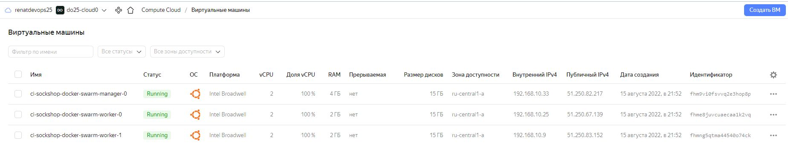

# Самостоятельная работа (HW-03) модуля D1.3 

1. Подготовил файлы конфигурации terraform.

2. Внес соответствующие изменения в конфигурацию для Docker Compose, указанную в задании (см. docker-compos.yml)

3. Инициализоровал terraform.

4. Через команду terraform apply создал 3 инстанса (manager и 2 worker) на которых запустились по 2 реплики frontend-сервиса.

> Скриншот созданных инстансов:

5. После успешного деплоя посетил стартовые страницы на worker нодах.

> Скриншоты стартовых старниц: 

6. По ssh подключился на ноду manager, где запустил: 
команды # docker service ls и # docker node ls

> Скриншот вывода:

7. Далее погасил проект.